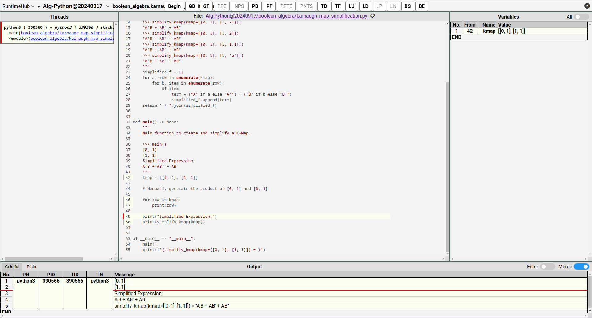

<!-- Title: -->
  
  <h1><a href="https://github.com/TheAlgorithms/">The Algorithms</a> - Python</h1>
<!-- Labels: -->
  <!-- First row: -->
  
  
  
  
  
  <!-- Second row: -->
   
  
  
  
<!-- Short description: -->
  <h3>All algorithms implemented in Python - for education</h3>

Implementations are for learning purposes only. They may be less efficient than the implementations in the Python standard library. Use them at your discretion.

## Runtime Visualization (Hot!)

Want to see how each Python program runs in real time? Go [RuntimeHub](https://RuntimeHub.com) to explore a collection of runtime visualizations for the Python programs in this project. These dynamic, out-of-the-box examples let you dive into the entire runtime execution process in a debugger-like environment, making it easy to interact with and understand.

For example, check out this runtime visualization of `boolean_algebra.karnaugh_map_simplification`:

You can follow the complete code flow of [boolean_algebra.karnaugh_map_simplification](https://github.com/runtimehub-com/TheAlgorithms-Python-runtime/blob/main/src.20240917.77bbe584/main/py/boolean_algebra/karnaugh_map_simplification.py) starting [here](https://runtimehub.com/p/alg-python@20240917:boolean_algebra.karnaugh_map_simplification/). Enjoy the experience! 😊

## About [RuntimeHub](https://RuntimeHub.com/)

[RuntimeHub](https://RuntimeHub.com/) is a dynamic, intuitive, and interactive platform that visualizes the entire runtime execution process of various programs. Our mission is to help developers, educators, and learners quickly understand software behavior through real-time execution traces, enhancing both productivity and learning efficiency.

For more details, check out the [RuntimeHub White Paper](https://runtimehub.com/en/the-white-paper-of-runtimehub.html).

## List of Algorithms

See our [directory](DIRECTORY.md) for easier navigation and a better overview of the project.

## List of Runtime Visualization Examples of our Algorithms

Explore the [runtime-directory](RUNTIME-DIRECTORY.md) for easy access to runtime visualization examples of each Python program in this project.

## Contribution Guide

Read through our [Contribution Guidelines](CONTRIBUTING.md) before you contribute.

## Community Channels

We are on [Discord](https://the-algorithms.com/discord) and [Gitter](https://gitter.im/TheAlgorithms/community)! Community channels are a great way for you to ask questions and get help. Please join us!
